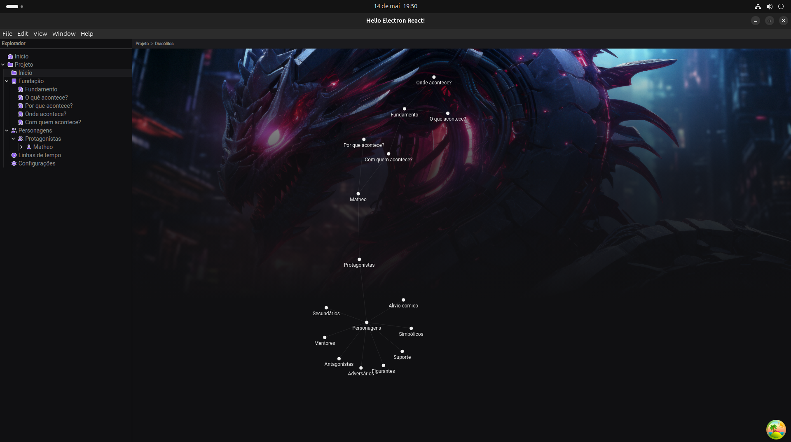
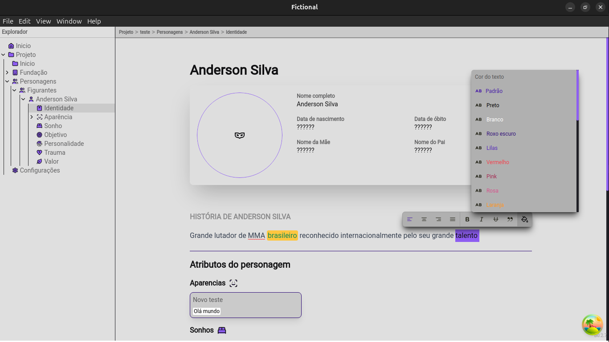

# Fictional - Aplicativo de Escrita Criativa

Fictional é um aplicativo de escrita criativa totalmente focado em escritores. Com ele, você pode definir e desenvolver histórias, criar personagens e seus atributos, e usar um editor de texto inteligente para dar vida às suas ideias. O Fictional é open source e está disponível no GitHub.




## Funcionalidades

- **Criação de Histórias**: Defina a base da sua história e outros elementos essenciais.
- **Criação de Personagens**: Crie personagens com seu fichario especifico.
- **Editor de Texto Inteligente**: Escreva e edite suas histórias com um editor de texto que auxilia na organização e desenvolvimento do seu texto.
- **Open Source**: Disponível no GitHub para que a comunidade possa contribuir e melhorar o aplicativo continuamente.

## Instalação

Para instalar o Fictional, siga os passos abaixo:

#### Windows
[Encontre o arquivo .exe nessa página](https://github.com/JPDovale/ms-desktop/releases)

#### Linux 
[Encontre o arquivo .AppImage ou .deb nessa página](https://github.com/JPDovale/ms-desktop/releases)

## Contribuição

Nós incentivamos contribuições de todos os tipos! Se você encontrou um bug, tem uma ideia para uma nova funcionalidade ou quer ajudar de qualquer outra forma, sinta-se à vontade para abrir uma issue ou enviar um pull request.

## Como Contribuir

1. Faça um fork do projeto.
2. Crie uma nova branch para a sua funcionalidade ou correção:
    ```bash
    git checkout -b minha-nova-funcionalidade
    ```
3. Faça as modificações desejadas.
4. Faça o commit das suas alterações:
    ```bash
    git commit -m "Adiciona nova funcionalidade"
    ```
5. Envie para o seu fork:
    ```bash
    git push origin minha-nova-funcionalidade
    ```
6. Abra um Pull Request no repositório original.

## Licença

Este projeto está licenciado sob a Licença GPL-3.0. Para mais informações, leia o arquivo [LICENSE](LICENSE).

## Contato

Para dúvidas, sugestões ou mais informações, entre em contato através do e-mail: [joaopaulodovaledeo.60@gmail.com](mailto:joaopaulodovaledeo.60@gmail.com).

---

Esperamos que o Fictional ajude você a transformar suas ideias em grandes histórias! Vamos escrever!

